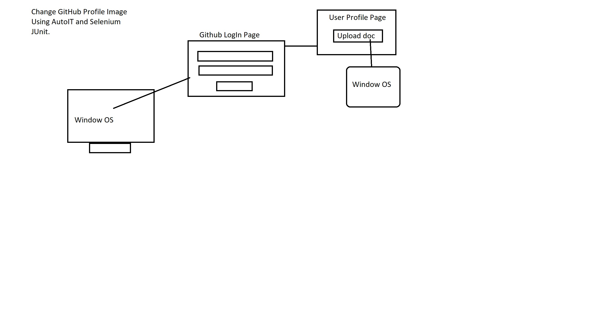

# Problem Statement: Upload profile image using AutoIT and Selenium jUnit. 



Steps To follow:  
 *To update github profile pic.*
> Go to your `Github Account`. Click on `Profile Pic`->Edit-Upload
> Then, go to the path of the `pic`. 

> Then with the help of `AutoIt Finder` and `AtuoIt Editor` Write script command as follows: . 


```
ControlFocus("Open","","Edit1");

ControlSetText("Open","","Edit1","E:\profile.png");

ControlClick("Open","","Button1");

```
> After writing this code, save the file in an appropriate location. 

> It will create a file with extension of `fileName.au3` file.
> Next :: Convert that file by right click on it -> `Compile_X64 `bit ->It will genearate `filename.exe` file. And, now use this file to automate the functionality.

Execution of above example:
> Go to your `Github Account`. Click on `Profile Pic`->Edit-Upload
> Then Click on the `AutoIt.exe File`. 

> And set new profile pic. 

> We use `AutoIT` as a tool to automate the task, which we can't able to do by using selenium.

Next Let's write selenium code to work on other functionality.

Using `jUnit` : 

> Create new `maven Project` as `quick start` archetype . 

> Then Add `driver folder`, where you can keep the driver of your `choice`. Then `Right Click` -> `Refresh`. 

> Add `jUnit depenedency` in `pom.xml`. 

> Then RightClick On The Project Name -> Maven -> Update Project -> Ok. 

> Start writing Code -> Compile it 

> ToDo :: Try it using `testNg` too
